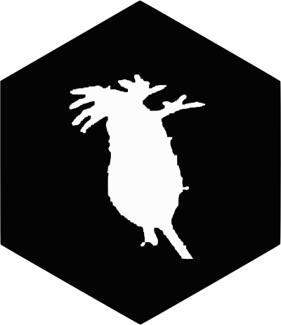
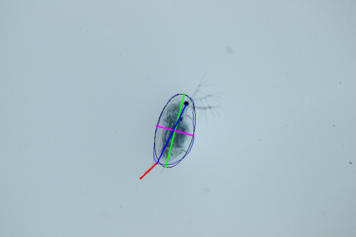

# daphniaruler <a href='https://nelstevens.github.io/daphniaRuler'></a>

<!-- badges: start -->
[](https://github.com/nelstevens/daphniaRuler/actions)
[](https://codecov.io/gh/nelstevens/daphniaRuler?branch=main)
<!-- badges: end -->

Automatically collect morphometric traits of Daphnia and other zooplankton species by leveraging python. Simply take images of individual specimen and point the daphniaruler towards a single image or a directory of images.

## Installation

You can install the daphnia ruler via github using remotes:

``` r
remotes::install_github("nelstevens/daphniaRuler")
```
If you experience issues during installation see: https://nelstevens.github.io/daphniaRuler/articles/installation_issues.html
## Usage
For detailed usage see: https://nelstevens.github.io/daphniaRuler/

### Measure single images:

``` r
library(daphniaruler)
measure_image("path/to/image")
```
The daphniaruler will output a list with all measured traits and plot measurements over the image.  
For details see: https://nelstevens.github.io/daphniaRuler/articles/measure_single_image.html


### Measure a directory: 
``` r
library(daphniaruler)
measure_directory("path/to/directory")
```
The daphniaruler will create a csv file containing all measured images within
the directory. Optionally copies of the images with results plotted over can
be saved to disk.
